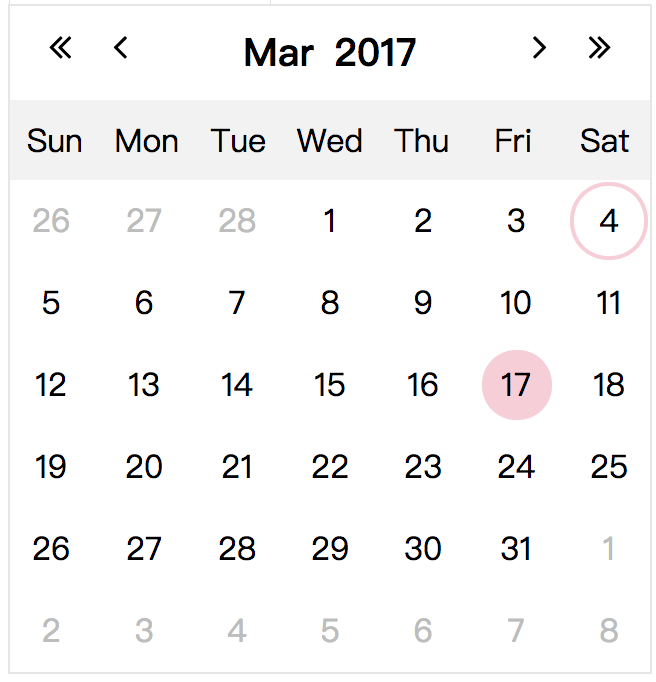

# Regional Date Picker

## Introduction
This date picker supports multiple calendar types, including Gregorian Calendar and Buddhist Calendar.

  

## Installation

#### Steps:
1. copy reg-date-picker plugin to your project folder

1. define reg-date-picker plugin in package.json

 * example: reg-date-picker folder is under module folder of your project 

      ```
      {
         ...
         "dependencies": {
          "reg-date-picker": "file:./module/reg-date-picker"
        },
        ...
      }
      ```

1. execute command under your project

   ```bash
   npm install
   ```

## Quick Start

1. import reg-date-picker plugin 

      ```js
      var DatePicker = require("reg-date-picker");
      ```

1. create DatePicker object

      ```js
      var dPicker = new DatePicker({
        container: document.querySelector(".date-picker"),
        date: 1488625381,
        onDateChange: function(unix){
          console.log(unix);
        }
      });
      ```
   
## Usage

* Below are available configurations.

     ```js
      var dPicker = new DatePicker({
        container: document.querySelector(".date-picker"),
        date: 1488625381,
        className: "customized",
        onDateChange: function(unix){
          console.log(unix);
        }
      });
      
      dPicker.setDate(1488470400);
      dPicker.getDate();
      dPicker.close();
      dPicker.destroy();
      
1. **Create date picker:** pass input field element in ```container``` configuration which is required (date picker using current date)

      ```js
      var dPicker = new DatePicker({
        container: document.querySelector(".date-picker")
      });
      ```

1. **Initialize date picker's date:** pass unix time in ```date``` configuration

      ```js
      var dPicker = new DatePicker({
        container: document.querySelector(".date-picker"),
        date: 1488625381
      });
      ```
      
1. **Customize date style:** pass ```className``` configuration to set className on date element in date picker

      ```js
      var dPicker = new DatePicker({
        container: document.querySelector(".date-picker"),
        className: "customized" 
      });
      ```
1. **Define date change event:** pass callback function in ```onDateChange``` configuration if want to handle date change event which receives unix time of selected date in date picker

      ```js
      var dPicker = new DatePicker({
        container: document.querySelector(".date-picker"),
        onDateChange: function(unix){
          console.log(unix);
        }  
      });
      ```

1. **Set date picker's date:** call ```setDate()``` to reset date by unix time in date picker

      ```js
      var dPicker = new DatePicker({
        container: document.querySelector(".date-picker")
      });

      dPicker.setDate(1488470400);
      ```

1. **Get date picker's date:** call ```getDate()``` to retrieve unix time of selected date in date picker 

      ```js
      var dPicker = new DatePicker({
        container: document.querySelector(".date-picker")
      });

      dPicker.getDate();
      ```

1. **Close date picker:** call close() to close date picker if needed

      ```js
      var dPicker = new DatePicker({
        container: document.querySelector(".date-picker")
      });

      dPicker.close();
      ```

1. **Remove date picker:** call destroy() to remove dete picker elements from DOM if it's not used anymore

      ```js
      var dPicker = new DatePicker({
        container: document.querySelector(".date-picker")
      });

      dPicker.destroy();
      ```

## Browser Support

Chrome, Firefox, Safari (not test in IE/Edge yet)

## Dependencies

Less

## Using

* pure js + less
* mocha + chi + sinon
* webpack
